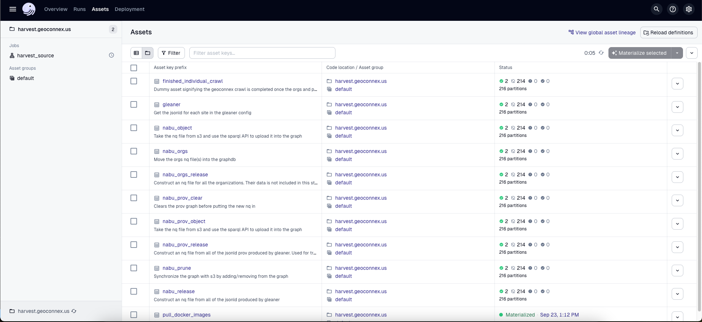
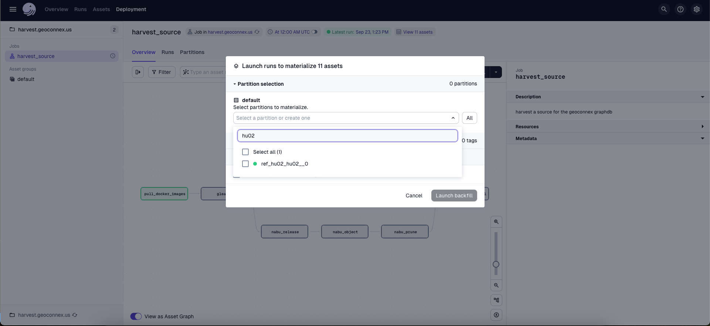
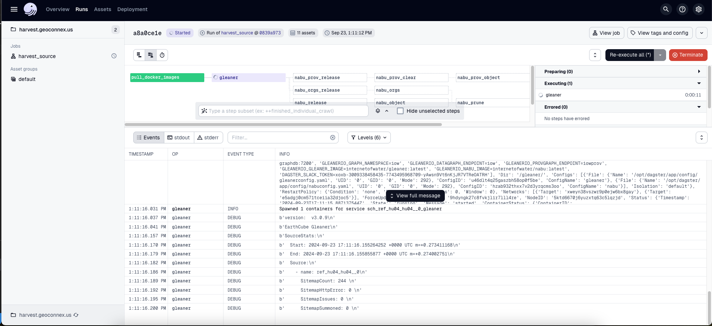

# Scheduler

This repository uses Dagster to run Nabu and Gleaner. Dagster is asset-oriented, and thus the graph is built primarily from the linking of assets, not just jobs.

The Geoconnex graph database is made up of the JSON-LD documents from over two hundred different organizations in the Geoconnex sitemap. In order to prevent code duplication, we use partitioned assets in Dagster.

The Geoconnex graph is set up to be crawled at a regular interval. However, to prevent overuse of resources or spamming target websites, we only allow one crawl at a time. To do this, we limit concurrency in Dagster to one job at a time. However, we still use concurrency within the same job when syncing our graph with the S3 bucket or other local operations.

The functionality of this repository is in rapid development. That being said, the general pattern is to generate the necessary Docker stack and configurations using the Python `main.py` CLI, run the docker swarm via the same CLI, and then open the Dagster UI at localhost:3000.

To launch a run manually, you can go to either the `Jobs` link or the `Asset groups` link. Then click on `Materialize all`.  

When you bring up the materializes window, You will have the option to select a variety of different sources. For testing purposes it is useful to pick a website with a small amount of data like `hu02` and not crawl the whole graph.

After you have materialized it you can then view the run in real time to see the result.

You can also rerun individual assets by going to the assets tab and then materializing the specific asset with the specific source you want. This is useful for rerunning failed runs without needing to recrawl an entire source, but since crawls are relatively fast, this is usually not necessary either way.

## Credit and Refactors from previous versions

This repository is a refactor of the [gleanerio/scheduler](https://github.com/gleanerio/gleaner) project. The goal of this refactor was to decrease code duplication and improve maintainability by reducing the amount of templated code using Jinja2. It also aimed to make the Dagster find a configuration more idiomatic to the asset-driven ETL paradigm that Dagster recommends.

Previously `pygen.py` templated a significant amount of `ops` that were nearly duplicated between providers. By using partitioned assets we can reduce this templated code and make the configuration less verbose.

## Gleaner and Nabu Notes

> NOTE: this docs section is WIP

gleaner processs

- takes an individual config and gets jsonld for each site

nabu release --cfg <cfgpath> --prefix prov/refgages0

creates s3:/myminio/iow/graphs/archive/refgages0/summoned\_\_refgages0_2024-07-08-21-49-19_release.nq and copies to s3:/myminio/iow/graphs/latest/refgages0_release.nq

- construct an nq file from all of the jsonld produced by gleaner

nabu --cfg <cfg> --endpoint iow_data object "/graphs/latest/refgages0_release.nq"

no changes occur to s3. 7193 should be count of triples in 'iow_data' repo (per cfg) after this cmd. src .nq file is 7193 (some triples are from base ontologties (70) and presumably rest inferred triples"

take the nq file from the s3 and use the sparql api to upload the nq object into the graph

nabu --cfg <cfg> prune --prefix "summoned/refgages0"

s3 does not change. graph triple count should not have changed (nothing to prune?). Will have to see if this behavior changes when running same dataset subsequent times to test for idempotency

This is like a diff that upadtes the graph. it is supposed to look at the prefix directory path and reconciles the files that exist with what exists in the graph. if there are any triples in the graph not in the s3, they will be deleted
s3 is the source of truth
if the graph is missing data it should be added

nabu --cfg <cfg> prefix --endpoint iow_prov --prefix "prov/refgages0"

s3 remains unchanged. (iow_prov) graph should have 4620 triples

similar to object but instead of looking for nq it looks for jsonld that are instances of the prov ontology and puts those into the graph
prov ontology is intended to establish data lineage. (metadata about construct of the final graph) We use both prov and object since they are orthogonal.
put in a different repository; didn't want to pollute the main graph

nabu --cfg <cfg> prefix --prefix "orgs"

no change to s3. expect 4660 triples in 'prov' repo which was previously 4620 before run ( 40 new triples from s3:/myminio/orgs/ which contains one .nq file for each source org harvested)

loads jsonld from the orgs directory in s3
loads info about the organization that provided the jsonld. flattened.
doesn't use prune. just a quirk of nabu
someting to test to see if it syncs
