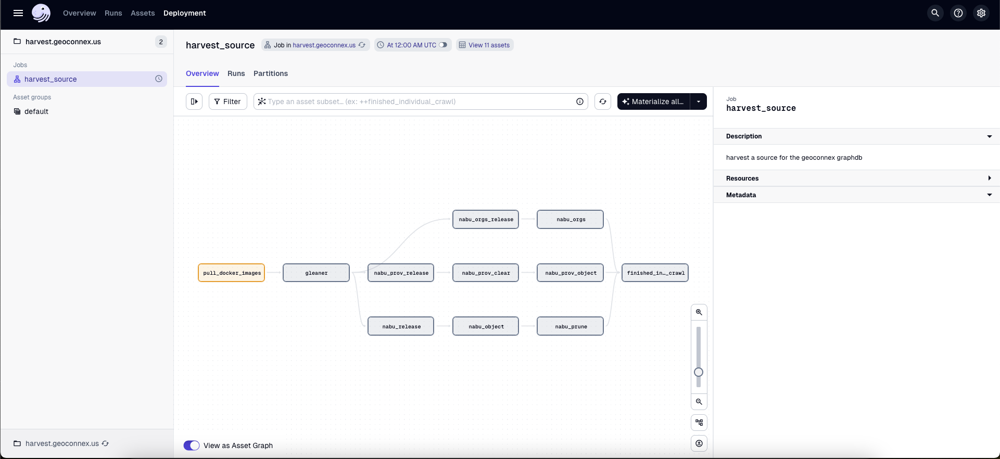
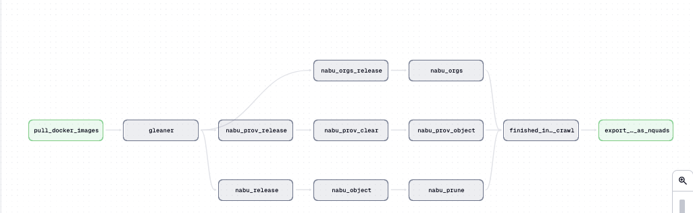

# Scheduler

This repository uses Dagster to run Nabu and Gleaner. Dagster is [asset-oriented](https://dagster.io/blog/software-defined-assets), and thus the graph is built primarily from the linking of assets, not just jobs.

The Geoconnex graph database is made up of the JSON-LD documents from over 200 different organizations in the Geoconnex sitemap. In order to prevent code duplication, we use [partitioned assets](https://docs.dagster.io/concepts/partitions-schedules-sensors/partitioning-assets) in Dagster. These allow the same asset definition to used across all of our sources.

The Geoconnex graph is set up to be crawled at a regular interval by using a [schedule](https://docs.dagster.io/concepts/automation/schedules) cron label. However, to prevent overuse of server resources or spamming target websites, we only allow one source in the job to be crawled at a time. To do this, [we limit concurrency in Dagster](https://docs.dagster.io/guides/limiting-concurrency-in-data-pipelines#limiting-overall-runs) to one job at a time. However, we still use concurrency within the same job when syncing our graph with the S3 bucket or other local operations.

If the **job** for an asset generation fails, a slack notification will be sent. 

> (NOTE: asset materialization via the UI is not a job, and thus will not trigger a notification)

## Running Dagster and the Geoconnex crawler

The functionality of this repository is in rapid development. That being said, the general pattern is to generate the necessary Docker stack and configurations using the Python `main.py up` CLI at the root of this repo, run the docker swarm via the same CLI, and then open the Dagster UI at localhost:3000.

> NOTE: You will need to install the proper Python dependencies from `requirements.txt` before running the CLI. Other dependencies for code that is run inside Dagster are handled by Docker.

To launch a run manually, you can go to either the `Jobs` link or the `Asset groups` link. Then click on `Materialize all`.  

When you bring up the `materialize` window, You will have the option to select a variety of different sources. For testing purposes it is useful to pick a website with a small amount of data like `hu02` and not crawl the whole graph.

After you have materialized it you can then view the run in real time to see the result. (This can be done by looking in the `Runs` tab)

You can also rerun individual assets by going to the assets tab and then materializing the specific asset with the specific source you want. This is useful for rerunning failed runs without needing to recrawl an entire source, but since crawls are relatively fast, this is usually not necessary either way.

## Docker and Docker Swarm

This repository currently uses Docker Swarm with one node. The previous iteration of the repository also used Docker Swarm. Upon testing, it seemed to not work with just docker compose so we stuck to docker swarm.

Despite this, Docker Swarm is still probably a good solution since it prepares us for future work with multiple nodes / high availability. It also supports rolling updates / secrets management and other helpers that are useful in a production environment but are harder to do in Docker compose.

## Refactors from previous versions

This repository is a refactor of the [gleanerio/scheduler](https://github.com/gleanerio/gleaner) project. The goal of this refactor was to decrease code duplication and improve maintainability by reducing the amount of templated code using Jinja2. It also aimed to make the Dagster configuration more idiomatic to the asset-driven ETL paradigm that Dagster recommends.

- Previously `pygen.py` templated a significant amount of `ops` that were nearly duplicated between providers. These were then moved into the container at build time.
  - By using [partitioned assets](https://docs.dagster.io/concepts/partitions-schedules-sensors/partitioning-assets) we can reduce duplicated code or templating
  - Our goal is to have as much of the pipeline be inside Dagster so it is easier to monitor and debug.
- We still template the gleanerconfig.yaml and nabuconfig.yaml files
  - This is since there are shared configs that are used by both. i.e. for minio
  - This templating is done before we build the image but in the future could be moved inside Dagster
- Legacy or outdated files were removed. There are files from previous `tutorials` or `deprecated` directories that were kept around only for historical purposes.
- Configuration specific to other organizations was removed
  - we only use one docker compose file, not any additional organization-specific `compose-override` files like the repository previously had
- Configuration and the amount of scripts needed to be ran was reduced
  - `main.py` spins up the docker swarm stack all with one command
    - `main.py` uses `typer` as a modern CLI so it automatically provides help and autocompletion
  - Extra setup and teardown shell scripts were removed and condense into `main.py`

## Gleaner and Nabu Notes

The current pipeline for gleaner/nabu operations in Dagster is as follows. All of the steps are inside Dagster [here](../code/main.py) with each being a separate asset.

Since Dagster uses docs as code, the best way to get the most accurate documentation is by opening up the local UI and looking at the asset description; this will source our code and the associated comments.

> NOTE: this docs section is WIP since we are still adding more features.

### gleaner

- takes an individual config and puts jsonld for each site inside the s3 bucket specified in the gleaner config
- `ARGS = ["--cfg", GLEANERIO_GLEANER_CONFIG_PATH, "-source", source, "--rude"]`

### nabu_release  

- construct an nq file from all of the jsonld produced by gleaner
- Example: creates s3:/myminio/iow/graphs/archive/refgages0/summoned\_\_refgages0_2024-07-08-21-49-19_release.nq and copies to s3:/myminio/iow/graphs/latest/refgages0_release.nq
- `ARGS = [ "release", "--cfg", GLEANERIO_NABU_CONFIG_PATH, "--prefix", "summoned/" + source ]`

### nabu_object

- take the nq file from the s3 and use the sparql api to upload the nq object into the graph
- `ARGS = ["--cfg", GLEANERIO_NABU_CONFIG_PATH, "object", f"/graphs/latest/{source}_release.nq", "--endpoint", GLEANERIO_DATAGRAPH_ENDPOINT]`
- Example: nabu --cfg <cfg> --endpoint iow_data object "/graphs/latest/refgages0_release.nq"

### nabu_prune

- Essentially a diff that upadtes the graph. Looks at the prefix directory path and reconciles the files that exist with what exists in the graph.
    - s3 is the source of truth
    - if the graph is missing data it should be added; if it has too much data it should be pruned
- `ARGS = ["--cfg", GLEANERIO_NABU_CONFIG_PATH, "prune", "--prefix", "summoned/" + source, "--endpoint", GLEANERIO_DATAGRAPH_ENDPOINT]`
- Example: `nabu --cfg <cfg> prune --prefix "summoned/refgages0 --endpoint iow`

### nabu_prov_release

- Construct an nq file from all of the jsonld prov produced by gleaner. Used for tracing data lineage using the prov ontology
- Puts this data in a separate `prov/` directory so that it is separate from the main one
- `ARGS = ["--cfg", GLEANERIO_NABU_CONFIG_PATH, "release", "--prefix", "prov/" + source]`

### nabu_prov_clear

- Clears the prov graph before putting the new prov ontology data in
- `ARGS = ["--cfg", GLEANERIO_NABU_CONFIG_PATH, "clear", "--endpoint", GLEANERIO_PROVGRAPH_ENDPOINT]`

### nabu_prov_object

- Take the nq file from s3 and use the sparql API to upload it into the prov graph repository
- `ARGS = ["--cfg", GLEANERIO_NABU_CONFIG_PATH, "object", f"/graphs/latest/{source}_prov.nq", "--endpoint", GLEANERIO_PROVGRAPH_ENDPOINT]`

### nabu_orgs_release

- Construct an nq file for the metadata of all the organizations
- `ARGS = ["--cfg", GLEANERIO_NABU_CONFIG_PATH, "release", "--prefix", "orgs", "--endpoint", GLEANERIO_DATAGRAPH_ENDPOINT]`

### nabu_orgs

- Move the orgs nq file(s) into the graphdb
- `ARGS = ["--cfg", GLEANERIO_NABU_CONFIG_PATH, "prefix", "--prefix", "orgs", "--endpoint", GLEANERIO_DATAGRAPH_ENDPOINT]`
