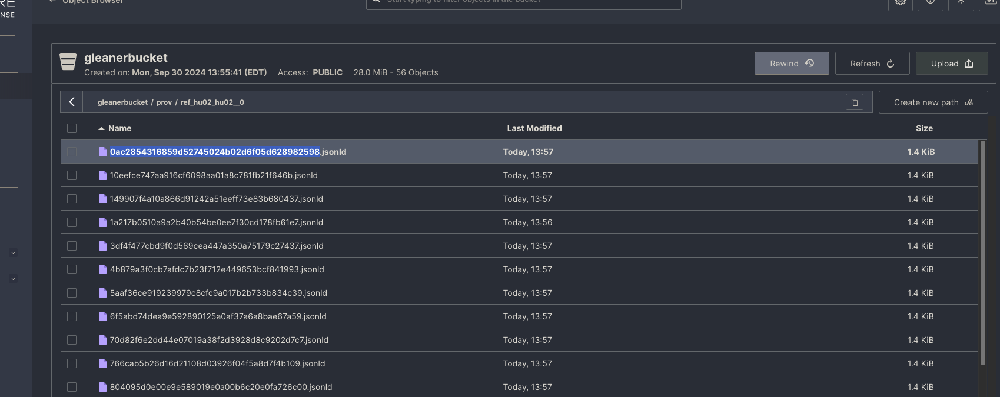
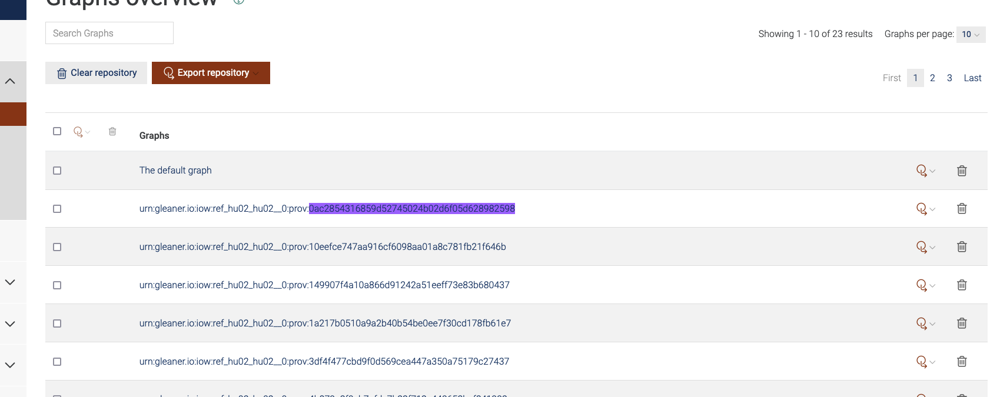
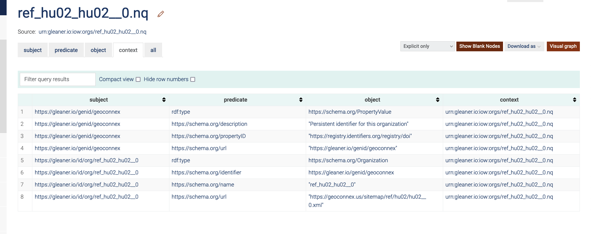

# Overview of graph outputs: nquads and HDT

In graphdb we use the option to add a fouth context term and use quads instead of only triples. The fourth term in the quad signifies which graph the triple is associated with and is essentially a metadata item.

Quads don't add anything strictly necessary for user facing sparql queries, however they make it easier to explore/debug in the graphdb UI.

- most contexts are associated with runs or other metadata that isn't relevant to the user
- only relevant metadata is the organization. But that could be gotten by filtering on other properties instead of context

## Tracing how context is added:

- `harvest` (previously known as gleaner)

  - `summoned/` and `prov/` directories are populated
  - a unique id is associated with each jsonld document
    
  - nothing is added in the graphdb at this point

- `nabu_release`/`nabu_object`/`nabu_prune`

  - adds the data to the graph and the associated context term in the graph matches back to the (what appears to be a hash) of the run

  

- `nabu_prov_release`/`nabu_prov_clear`/`nabu_prov_object`

  - very similar to above, but just for the prov graph

- `nabu_orgs_release`/`nabu_orgs`
  - orgs is added as a separate graph within the main iow repository.
  - only adds a bit of metadata which is associated with the fourth context term
    
